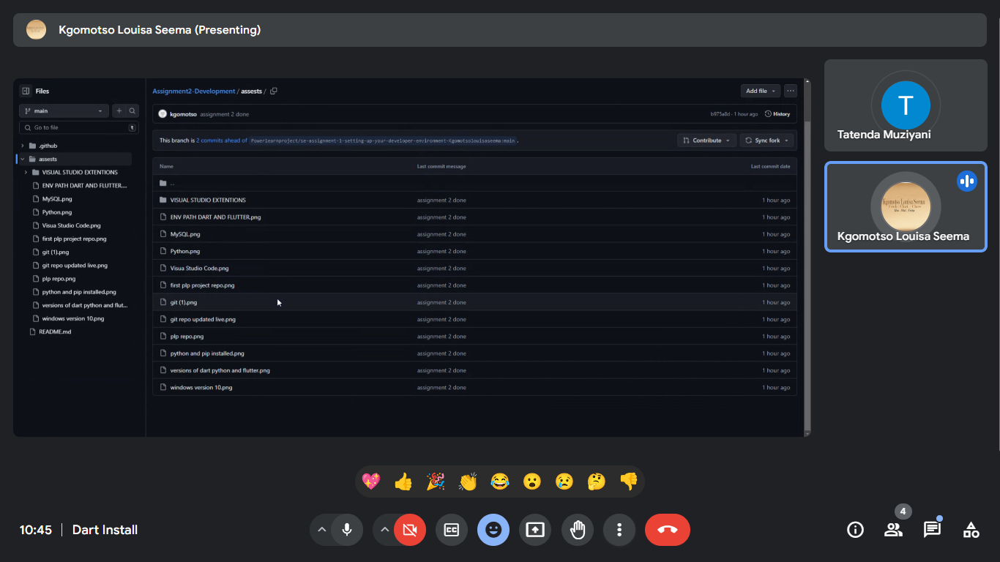

# SE-Assignment-5
Installation and Navigation of Visual Studio Code (VS Code)
 Instructions:
Answer the following questions based on your understanding of the installation and navigation of Visual Studio Code (VS Code). Provide detailed explanations and examples where appropriate.

 Questions:

1. Installation of VS Code:
   - Describe the steps to download and install Visual Studio Code on Windows 11 operating system. Include any prerequisites that might be needed.

   Answer :
   Steps for Downloading and Installing Visual Studio Code:
Open Web Browser.png>):

Open your favorite web browser, such as Edge, Chrome, or Firefox.
Go to the Visual Studio Code Website:

Open the official website of Visual Studio Code: Visual Studio Code.
Download Installer:

On the homepage will be a large download button that automatically detects your OS. Click the Download for Windows button.
If it doesn't correctly detect your OS, you can click the Download dropdown and select Windows.
Run the Installer:

After downloading, switch to your Downloads folder and run the installer by double-clicking the downloaded VSCodeSetup.exe.
Begin Installation:

A setup wizard will pop up; continue the installation by clicking the Next button.
Accept the Licence Agreement:

Read this license agreement. If you agree with the terms, select I accept the agreement and then click Next.
Select Installation Location:

Select the folder where you want to install Visual Studio Code. Usually, it will be more than enough to have a default location. Click Next.
Select Additional Tasks:

You'll be asked to select the additional tasks. Checking the following options is recommended for a better experience:
Create a desktop icon: This will grant users easy and fast access to VS Code from their desktop.
Add the "Open with Code" action to the Windows Explorer file context menu: This allows files and folders inside Explorer to be opened in VS Code by right-clicking.
Add the ability to "Open with Code" to the Windows Explorer directory context menu: Does the same as above, but for directories.
Register Code as an editor for supported file types: This sets VS Code as the default editor to open those types of files.
Add to PATH: This will allow you to open VS Code from the Command Line.

Install:

Click the Install button to start the installation process. The installer copies files required on your system.

Finish Installation:

Once it is installed, you will see the final screen. If you want to open VS Code immediately after installing, then check the box Launch Visual Studio Code. Finally, click Finish.

Post-Installation:

Open Visual Studio Code:

If you did not select Open or Launch VS Code during the installation process, you can run VS Code by double-clicking the desktop icon created during installation or searching for VS Code in your Start menu. Install Extensions: VS Code supports many extensions that significantly enhance its capabilities. You can install extensions by clicking on the Extensions icon in the Activity Bar on the side of the window or by going to the View > Extensions menu. Update Settings: The settings can be modified by executing File > Preferences > Settings of VS Code. There, you will have quite several different ways to make this editor controlled according to your usage. Install Git (Optional but Recommended): If you would also like to use version control, you should probably install Git. You can download Git from here, run the installer and just follow the Wizard through. VS Code will detect Git automatically if it is installed. By following these steps, you will have installed and be set to start using Visual Studio Code on the Windows 11 operating system.

2. First-time Setup:
   - After installing VS Code, what initial configurations and settings should be adjusted for an optimal coding environment? Mention any important settings or extensions.

   Answer :
  The steps involved in the initial setup of VS Code after installation on a Windows 11 device are as follows:.

### Initial Configurations:

1. **Theme Selection:**
- Open **File** > **Preferences** > **Color Theme** and select one of the many themes that may suit your taste.

2. **Set Font Size and Type**:
- In **File** > **Preferences** > **Settings**, search for "Font Size" and change the "Font Family" to your liking.

3. **Auto Save On**:
- In **File** > **Preferences** > **Settings**, in search, enter "Auto Save". Set it to `afterDelay`.

4. **Format on Save**:
Open **File** > **Preferences** > **Settings**, then search "Format On Save" and check the box.

&nbsp;&nbsp;&nbsp;5. **Configure Tab and Indentation**:
- In the **File** menu, hover **Preferences** > **Settings**, then search for "Tab Size" and "Indentation."

### Recommended Extensions:

1. **Python**: `ms-python.python`
2. **JavaScript/TypeScript**: `dbaeumer.vscode-eslint`
3. **HTML/CSS**: `ecmel.vscode-html-css` 4. **Prettier**: `esbenp.prettier-vscode`

5. **GitLens**: `eamodio.gitlens`

6. **Live Server**: `ritwickdey.liveserver`

7. **Path Intellisense**: `christian-kohler.path-intellisense` ### Additional Tips: - **Open VS Code**: From Start menu or desktop shortcut. **Install Extensions**: On the sidebar, click on the Extensions icon,, and find/install the above extensions. - **Customize Further**: Go to **File** > **Preferences** > **Settings** and adjust any additional settings as needed. By configuring these settings and installing recommended extensions, you will have an optimal VS Code setup for coding. 

3. User Interface Overview:
   - Explain the main components of the VS Code user interface. Identify and describe the purpose of the Activity Bar, Side Bar, Editor Group, and Status Bar.

Answer :

### VS Code Interface Overview:

1. **Activity Bar
- **Location**: Left side.
- **Objective**: Providing fast access to Explorer, Search, Source Control, Run and Debug, and Extensions.

2. **Side Bar**:
- **Position**: Beside the Activity Bar.
- **Purpose**: Displays content based on the selected activity, such as file structure, search results, source control info, and extensions.

3. **Editor Group
- **Location**: Center. - **Purpose**: It serves as the primary area for file editing. Multiple tabs and split views are supported, enabling file editing side by side.

4. **Status Bar

- **Location**: Bottom. - **Purpose**: This indicator displays the current file and workspace information, including line numbers, Git branch, file encoding, and notifications. This short overview is going to give you an understanding of the main parts of the VS Code UI so you can navigate around the editor with ease.

4. Command Palette:
   - What is the Command Palette in VS Code, and how can it be accessed? Provide examples of common tasks that can be performed using the Command Palette.
    
    Answer :

  Command Palette in VS Code

**What**: A tool to access various commands and features quickly.

**How to Access:**
• Press `Ctrl + Shift + P` (Windows/Linux) or `Cmd + Shift + P` (Mac).

### Common Tasks Using the Command Palette:
- **Open Settings**: Type "Preferences: Open Settings".
- **Install Extensions**: Type "Extensions: Install Extensions".
**Format Document** Type "Format Document". - **Toggle Terminal**: Record "View: Toggle Integrated Terminal".

**Search Files**: Enter "File: Open File." or "Go to File.". With the Command Palette, one can perform tasks efficiently without working through menus or documents.  

5. Extensions in VS Code:
   - Discuss the role of extensions in VS Code. How can users find, install, and manage extensions? Provide examples of essential extensions for web development.

   Answer : 

   ### Role of Extensions in VS Code

**What**: Extensions enhance functionality and customize the coding environment.

How to Find, Install and Manage Extensions

1. **Find Extensions:**
•**Extensions View Open**: The Extensions icon in the Activity Bar, or `Ctrl + Shift + X`.

2. **Installing Extensions:**
- Search for the extension in the Extensions View.
- Click the **Install** button next to the extension you want to use.

3. **Extension Management:**
Manage Extensions -: Open Extensions Icon • View installed extensions: Click the Extensions icon.
• Disable/Enable: Click the gear icon next to an extension.
- Uninstall: Click the gear icon then, finally, select **Uninstall**.

Essential extensions for web development.

1. **Prettier**: Code formatter (`esbenp.prettier-vscode`). 2. **ESLint**: Linting for JavaScript/TypeScript (`dbaeumer.vscode-eslint`).

3. **Live Server**: Open a local server with live reload (`ritwickdey.liveserver`). 4. **HTML CSS Support**: HTML and CSS intellisense (`ecmel.vscode-html-css`). 5. **GitLens**: Git supercharged (`eamodio.gitlens`). Extensions significantly boost productivity and tailor the VS Code experience to specific development needs.

6. Integrated Terminal:
   - Describe how to open and use the integrated terminal in VS Code. What are the advantages of using the integrated terminal compared to an external terminal?

   Answer :

   Integrated Terminal in VS Code

**How to Open**:
- Click **View** > **Terminal** or press `` Ctrl + ` ``.

**How to Use**:
- **Run Commands**: Write commands and hit `Enter`.
- **New Terminal**: Click the `+` icon.
- **Switch Terminals**: Select through the drop-down box.

### Advantages of Integrated Terminal

1. **Convenience**: Now open the terminal right inside VS Code; no need to switch windows. 2. **Context Awareness**: By default, this will open in the root of your project.

3. **Multi-Terminal Support**: Run several terminals side by side. 4. **Consistency**: Same environment and settings as the editor. The integrated terminal improves productivity, providing a smoother workflow with everything in one place.

7. File and Folder Management:
   - Explain how to create, open, and manage files and folders in VS Code. How can users navigate between different files and directories efficiently?

   Answer :

  File and Folder Management in VS Code

**Create**:
- **File**: Right click in Explorer > **New File** or use `Ctrl + N`.
They are as follows: - **Folder**: Right-click in Explorer > **New Folder**.

**Open**:
- **File/Folder**: Open file/folder with menu item **File** > **Open File**/**Open Folder**, or by using the commands `Ctrl + O` for files and `Ctrl + K, Ctrl + O` for folders.

**Manage**:
- **Rename**: Right-click > **Rename**.
- **Delete**: Right-click > **Delete**.
- **Move**: Drag-and-drop within the Explorer.

Efficient Navigation

- **Quick Open**: By ` Ctrl + P`, it opens a search to type the name of a file.

- **Explorer**: The sidebar is used to browse across files and open them. • **Go to Definition**: Right click a function/variable results > **Go to Definition**, or press `F12`. - **Breadcrumbs**: Click on the path at the top of the editor to navigate directories. These features simplify the management of files and folders, making navigation very fast. 

8. Settings and Preferences:
   - Where can users find and customize settings in VS Code? Provide examples of how to change the theme, font size, and keybindings.

   Answer :

   Settings and Preferences in VS Code

**access settings**:
– Open either **File** > **Preferences** > **Settings**, or press `Ctrl + ,`.

### Change Theme
1. **Open Settings**.
2. Type "Color Theme".
3. Select your theme from this dropdown.

### Change Font Size
1. **Open Settings**.
2. Type "Font Size".
3. Type the value of your intended Font size.

### Change Keybindings

1. Under **File**, click **Preferences**, the click **Keyboard Shortcuts**, or use the keyboard shortcut `Ctrl + K, Ctrl + S`. 2. Locate the command. 3. Click the icon with the pencil image in it to edit, then press your new key combination. These steps will let you better and more easily customize your VS Code environment.

9. Debugging in VS Code:
   - Outline the steps to set up and start debugging a simple program in VS Code. What are some key debugging features available in VS Code?

Answer :

Setting up and Starting Debugging in VS Code

1. **Open Your Project**:
- Open a folder containing all your code files.

2. **Debug Panel Open**:
- Click the Debug icon in the Activity Bar or press ` Ctrl + Shift + D`.

3. **Create a Launch Configuration:**
- Click on the gear icon to create a `launch.json` configuration file.
- Select an environment: e.g., Node.js for JavaScript.

4. **Set Breakpoints:**
- Click in the gutter next to the line numbers in your code to set breakpoints.

5. **Start Debugging**: - Click the green play button in the Debug panel, or press ` F5`.

### Key Debugging Features

- **Breakpoints**: The execution is paused at some lines.

- **Watch Variables**: Watch variable's values. - **Call Stack**: View the order of function calls. - **Step Over/Into/Out**: Stepping execute by lines. - **Debug Console**: Evaluate expressions and run commands. Steps and characteristics that make debugging easier in VS Code.

10. Using Source Control:
    - How can users integrate Git with VS Code for version control? Describe the process of initializing a repository, making commits, and pushing changes to GitHub.

Answer :

Taken from source: Using Source Control (Git) in VS Code

1. **Initialize a Repository:**
- Open your project folder in VS Code.
- The Source Control icon on the Activity Bar: (`Ctrl + Shift + G`).
- Click **Initialize Repository**.
Write a commit message, then press `Ctrl + Enter`.

2. **Make Commits**:
- Stage changes Click `+` next to files in the Source Control view.
Write a commit message, then press ` Ctrl+Enter` to commit.

3. **Push Changes to GitHub:**
Ensure that you have added a remote repository (GitHub).
- In the Source Control view, click the ellipsis (`.`) and select **Push**.
- Select the Branch to push and confirm.

### Shortcuts:

- Initiate: Click on `Initialize Repository`. -Commit: Stage changes Enter message `Ctr + Enter`. - Push: Click ellipsis (`.`), select **Push**. The following steps will let you enable Git for version control right inside VS Code.

 Submission Guidelines: 1 July 2024

- Your answers should be well-structured, concise, and to the point.
- Provide screenshots or step-by-step instructions where applicable.
- Cite any references or sources you use in your answers.

references:https://code.visualstudio.com/,https://support.zoom.com/hc/en/article?id=zm_kb&sysparm_article=KB0059856,

- Submit your completed assignment by 1st July 

